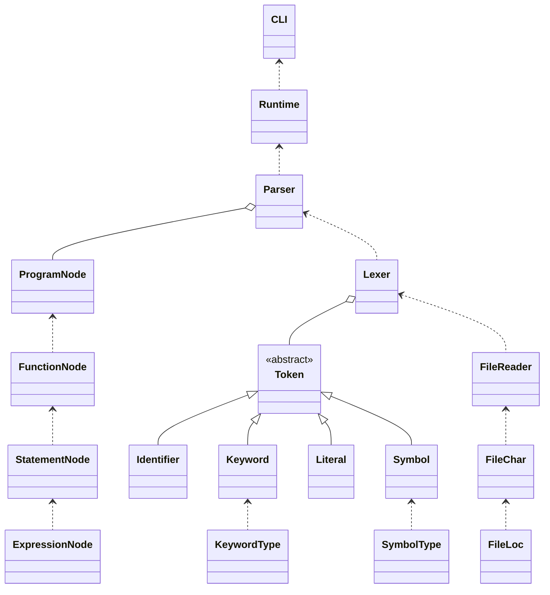

# Preliminary Specifications


**DJI - Dumb Java Interpreter**

Andy Min - 2021 May 7

## Overview

DJI is a simple interpreter for a Java-like language with a small subset of features and syntax from Java. The interpreter features a custom lexical analyzer, parser, and runtime engine. The interpreter will have a friendly command line interface where users can input their source files to run the program.

Source files will have a `.djava` file extension and consist of Java-like syntax.

Supported features:

- Variable initialization and assignment
- Primitive data types (and Strings): `boolean`, `char`, `int`, `double`, `String`, `void`
- Literals: e.g. `false`, `'a'`, `123`, `12.3`, `"asdf"`
- Math operations: `+`, `-`, `*`, `/`, `%`, `+=`, `-=`, `*=`, `/=`, `%=`, `=`, `!`, `++`, `--`, `==`, `<`, `>`, `!=`, `<=`, `>=`, `&&`, `||`
- Control structures: `if`, `else`, `for`, `while`, `break`, `continue`, `return`
- Functions: return type, parameters, `main` function that returns an integer
- Simple user errors with error messages that include the location of the error (line, column)

Unsupported features

- Classes and object oriented programming
- Multiple source files
- A standard library

Example `djava` program:

```
int main() {
    int a = 5;
    a += triple(a);
    if (a > 10) {
        return 3;
    } else {
        return 5;
    }
}

int triple(int num) {
    return num * 3;
}
```

When the user inputs a `djava` source file, the interpreter will first perform lexical analysis to split the program into individual tokens. The lexer will identify tokens based on their first characters. For example, a `"` indicates a `Literal.String`, a digit indicates either a `Literal.Integer` or `Literal.Double`, a regular alphabet character indicates either a `Keyword` or a `Symbol`, and everything else is either a `Symbol` or an unknown token. 

The tokens are then parsed into an abstract syntax tree. The parser reads in a stream of tokens to properly construct the tree. In order to have proper order of operations when parsing mathematical expressions, the parser will use the Shunting-yard algorithm.

Finally, the abstract syntax tree is interpreted by the runtime engine which will print out the returned integer from the `main` function. The runtime features a variable map stack to allow proper variable scoping. For example, when an `if` statement ends, all the variables declared inside the `if` statement are now obsolete. Calling functions also creates new a new variable scope.

## Structural Design

DJI uses the following data structures.

| Data                                            | interface => class                                 |
| ----------------------------------------------- | -------------------------------------------------- |
| Lexer: list of program tokens                   | `List` => `ArrayList<Token>`                       |
| Parser: program abstract syntax tree            | Class hierarchy with "algebraic data type" classes |
| Parser: function parameters                     | `List` => `ArrayList<String>`                      |
| Parser: function call arguments                 | `List` => `ArrayList<Value>` *                     |
| Runtime: variable name to current value mapping | `Map` => `HashMap<String, Value>`  *               |
| Runtime: variable scope stack                   | `Stack` => `Stack<Map<String, Value>` *            |
| Runtime: function name to function mapping      | `Map` => `HashMap<String, FunctionNode>` **        |

\* where `Value` is a class that holds information about the variables type and value.

\** where `FunctionNode` is the node for functions in the abstract syntax tree.

The lexer will output the program tokens in an `ArrayList`. The parser will output an abstract syntax tree composed of `Node` classes that resemble algebraic data types by having several static subclasses. For example, the `ExpressionNode` class will include the following static subclasses: `ExpressionNode.Literal`, `ExpressionNode.FunctionCall` `ExpressionNode.VariableReference`. The parser will also hold function parameters and arguments in `ArrayList`s. For the runtime, variables are stored in a `HashMap` that maps a variable name to a `Value` class that contains the variable's type and value. Since proper variable scoping will also be implemented, the variable maps will be wrapped in a `Stack`. For example, using an `if` statement will create a new variable scope and thus push a new variable map onto the stack. The runtime will also store a `HashMap` of function names to the function nodes themselves so the proper function can be executed when it is called.

## Object Oriented Design



The following diagram shows the overall structure for DJI. The CLI class will take the user's inputs and run the interpreter `Runtime`, while takes in the abstract syntax tree (`ProgramNode`) generated by the `Parser`. The `Parser` takes in a list of `Token`s generated by the `Lexer`. The `Lexer` reads the user's program with `FileReader` which reads the file into a list of `FileChar`s: characters associated with the character's location in the file (`FileLoc`).

The list of `Token`s generated by the `Lexer` consists of a `Token` abstract class with `Identifier`, `Keyword`, `Literal`, and `Symbol` subtypes.

The abstract syntax tree generated by the `Parser` consists of a root `ProgramNode` which contains a map of `FunctionNode`s. Each `FunctionNode` contains information about the functions return type, parameters, and a list of `StatementNode`s. Each `StatementNode` consists of one or more `ExpressionNode`s.

## Detailed Design

The detailed design specs for each class are listed in the project's generated Javadoc.

## Testing

The project will include unit tests to test individual classes and components, as well as integration tests that will test the entire interpreter pipeline against example `djava` programs to test proper outputs and proper user errors.